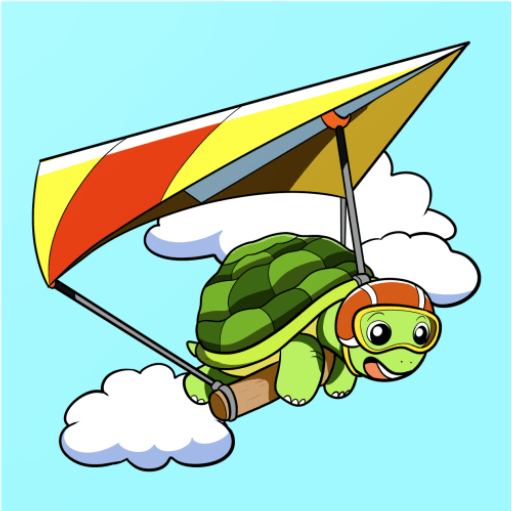

<!-- PROJECT LOGO -->

<h3 align="center">GPS Tracker For Pilots</h3>

  

  

    
    
  

<!-- TABLE OF CONTENTS -->

  
Table of Contents

  <ol>
    <li>
      <a href="#about-the-project">About The Project</a>
      <ul>
        <li><a href="#built-with">Built With</a></li>
      </ul>
    </li>
    <li>
      <a href="#getting-started">Getting Started</a>
      <ul>
        <li><a href="#prerequisites">Prerequisites</a></li>
        <li><a href="#installation">Installation</a></li>
      </ul>
    </li>
    <li><a href="#usage">Usage</a></li>
    <li><a href="#roadmap">Roadmap</a></li>
    <li><a href="#contributing">Contributing</a></li>
    <li><a href="#license">License</a></li>
    <li><a href="#contact">Contact</a></li>
    <li><a href="#acknowledgments">Acknowledgments</a></li>
  </ol>

<!-- ABOUT THE PROJECT -->
## About The Project

This project is an aviation application for free flight pilot's (paragliding , handgliding ...). A GPS unit attached to the pilot exposes flight data (position, altitude, ground speed, flight direction and other) to a UI so other co-pilots be able to monitor on a map the pilot's flight in real time.

(<a href="#readme-top">back to top</a>)

## Architectural diagram 

  

## Description of Architecture
In progress ...
### Built With

* 
* 
* 
* 
* 
* 
* 
* 

(<a href="#readme-top">back to top</a>)

<!-- GETTING STARTED -->
## Getting Started
In progress ...

### Prerequisites
In progress ...

### Installation
In progress ...

<!-- CONTRIBUTING -->
## Contributing

If you have a suggestion that would make this better, please fork the repo and create a pull request. You can also simply open an issue with the tag "enhancement".

1. Fork the Project
2. Create your Feature Branch (`git checkout -b feature/AmazingFeature`)
3. Commit your Changes (`git commit -m 'Add some AmazingFeature'`)
4. Push to the Branch (`git push origin feature/AmazingFeature`)
5. Open a Pull Request

(<a href="#readme-top">back to top</a>)

### Top contributors:
<!--

-->
<!-- LICENSE -->
## License

Distributed under the project_license. See `LICENSE.txt` for more information.

(<a href="#readme-top">back to top</a>)

<!-- CONTACT -->
## Contact

Petros Iakovou - berxt@hotmail.com

Project Link:[(https://github.com/PetrosIakovou/GpsTracker)](https://github.com/PetrosIakovou/GpsTracker)

(<a href="#readme-top">back to top</a>)

## Acknowledgments

<!-- MARKDOWN LINKS & IMAGES -->
<!-- https://www.markdownguide.org/basic-syntax/#reference-style-links -->
[linkedin-shield]: https://img.shields.io/badge/-LinkedIn-black.svg?style=for-the-badge&logo=linkedin&colorB=555
[linkedin-url]: [https://linkedin.com/in/linkedin_username](https://www.linkedin.com/in/petros-iakovou/)

